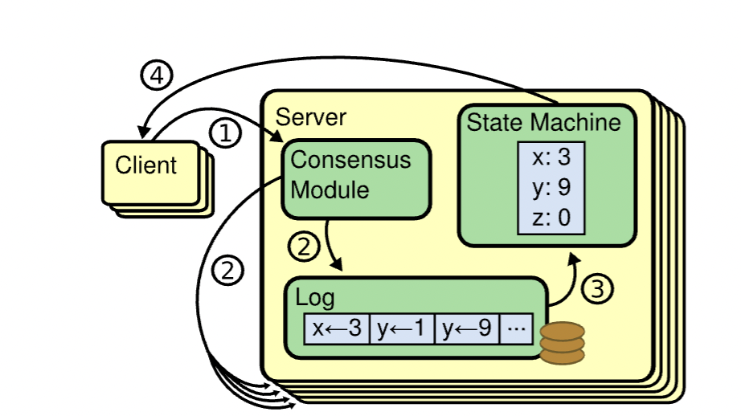

# 共识算法

> Consensus is a fundamental problem in fault-tolerant distributed systems，Consensus involves multiple servers agreeing on values

共识是容错的一个基本问题。共识算法解决的是分布式系统对某个提案（Proposal），集群中所有节点都达成一致意见的过程

# raft是什么

raft算是一种共识算法，解决了一个分布式集群如何达成同意values的问题



> etcd Raft 模块设计实现上抽象了网络、存储、日志等模块，它本身并不会进行网络、存储相关的操作，上层应用需结合自己业务场景选择内置的模块或自定义实现网络、存储、日志等模块。唐聪，《etcd 实战课》

# 复制状态机（Replicated state machines）

- 约定存储的是日志

# raft共识算法实现

## 0. 可视化链接：

https://thesecretlivesofdata.com/raft/


## 1. 节点状态（Server states）

每个节点只会有三种状态，leader, follower, 或者 candidate.

## 2. 任期

Raft 里的逻辑时钟，从 0 开始，随着每次选举的发起而递增

## 3. RPCs

节点之间的通讯方式，最基础的共识算法，只需要两种 

1. RPC，RequestVote RPCs 
2. AppendEntries RPCs

# 步骤

## 1. Leader Election
### 名词定义
1. Append Entries: leader -> followers, follower reply

2. Term: 是什么，何时增加修改？

> raft divides time into terms of arbitrary length


如果有leader，那么所有的节点维护的term是一致的。否则，在竞选状态时，以高的term为大，谁的term高谁的话语权高

> tips: 相同term下，如果有的candidate a term_a 比 candidate b term_b来的早(term_a < term<b ), 那可能会投票给term_a而不是term_b


### 基本思路

下面是完成的表格，展示了在Raft协议中，leader、candidate和follower在接收到RequestVote和AppendEntry请求时的行为，取决于请求中的term与节点当前的term的比较：

|  | RequsestVote |  |  | AppendEntry |  |  |
| --- | --- | --- | --- | --- | --- | --- |
|  | req.term>currentTerm | req.term=currentTerm | req.term<currentTerm | req.term>currentTerm | req.term=currentTerm | req.term< currentTerm |
| leader | 变为follower，更新term，重新评估投票 | false (拒绝投票)  | false (拒绝投票)  | 变为follower，更新term | 忽略请求 | 忽略请求 |
| candidate | 变为follower，更新term，重新评估投票 | false (拒绝投票) | false (拒绝投票)  | 变为follower，更新term | 变为follower，接受来自leader的消息 | 忽略请求 |
| follower | 更新term，没投票则投票，否则拒绝 | 没投票则投票，否则拒绝 | false (拒绝投票)  | 更新term，接受新leader | 接受来自leader的消息  | 忽略请求 |


- leader send heartbeat RPCs no more than ten times per second.

```go
// return currentTerm and whether this server
// believes it is the leader.
func (rf *Raft) GetState() (int, bool)

func (rf *Raft) sendRequestVote(server int, args *RequestVoteArgs, reply *RequestVoteReply) bool

func beginElection()

```

- 批量发选票，批量收获所有的结果。如果结果中true的票数 > false的票数，它就成功变成leader

- candidate时处理其他leader发来的心跳信息，是自己变成follower还是继续candidate？此时candidate的term肯定是大于老leader的term的

- 如果新leader收到老leader的心跳信息，会怎么样呢？

- follower投票完还会变成candidate吗：会，自己超时后也会开启投票


- follower在收到心跳信息后，会重新计时判断心跳的实现逻辑：

在时间等待前后判断currentLeader是否是-1

```go
func (rf *Raft) tickerAsFollower() {
	for {
		// 判断是否超时，转换状态
		rf.currentLeader = -1
		ms := 500 + (rand.Int63() % 400)
		time.Sleep(time.Duration(ms) * time.Millisecond)
		DPrintf("[%d,%d] is follower, leader : %d", rf.me, rf.currentTerm, rf.currentLeader)

		if rf.currentLeader == -1 {
			rf.state = 1
			return
		}
	}
}
```


### 特殊情况

1. split vote: 

要考虑到，有的follower如果失联，这时判断split vote时就不能只判断是否是peers个数的一半了。


2. 同一个term内先后收到两个符合要求的RequestVote, 应该怎么办？

答：根据first-come-first-served，给第一个投票。

> server will vote for at most one candidate in a given term, on a first-come-first-served basis


对于第一个请求，如果其term大于follower的currentTerm，follower会更新其currentTerm为请求中的term，然后根据Raft的规则（包括日志的新旧程度等）决定是否投票。

对于第二个请求，如果其term大于更新后的currentTerm，follower将再次更新其currentTerm。但是，如果follower已经在更新后的任期内投了票（无论是给第一个请求的候选人还是之前的某个候选人），根据Raft协议，它不会在同一任期内投第二次票。

```go
	if rf.votedFor != -1 {
		DPrintf("【%d, %d】<------x------ [%d, %d](status: %d) , already vote or leader for %d, leader %d", args.CandidateId, args.Term, rf.me, rf.currentTerm, rf.state, rf.votedFor, rf.currentLeader)
		reply.VoteGranted = false
		return
	}
```

3. requstVote里广播消息时，如果某一个server消息返回超时怎么收集选票？

方法一：设置ctx上下文超时机制，修改rpc的调用函数。但是这里在lab中不允许我们修改Call方法，因此弃用

方法二：使用go中的`sync.WaitGroup`, 开启一个广播线程时调用wg.add(1), 线程结束前采用wg.Done(), 最后wg.Wait进行阻塞，直到所有线程均返回结果。缺点：rpc失联还是会超时，因为在raft/config文件中设置了`cfg.net.LongDelays(true)`, 因此弃用。

方法三：在线程调用时变判断公用的选票信息done与posVotes, 前者判断是否成为leader，后者判断是否有成为leader的条件，并置done为true。

方法四（推荐，目前使用）：内嵌一个go线程+判断内嵌线程的超时机制。

```go
go func(peerIndex int) {
	ch := make(chan bool, 1)

	// 嵌套机制方便实现超时判断
	go func() {
		ch <- rf.sendRequestVote(peerIndex, &args, &reply)
	}()

	select {
	case ok := <-ch:
		// logic
		wg.Done()
	case <-time.After(time.Duration(timeout) * time.Millisecond):
		wg.Done()
	}
}(peerIndex)
```

## 2. Log Replication


partition:

Both nodes A & B will roll back their uncommitted entries and match the new leader's log 
